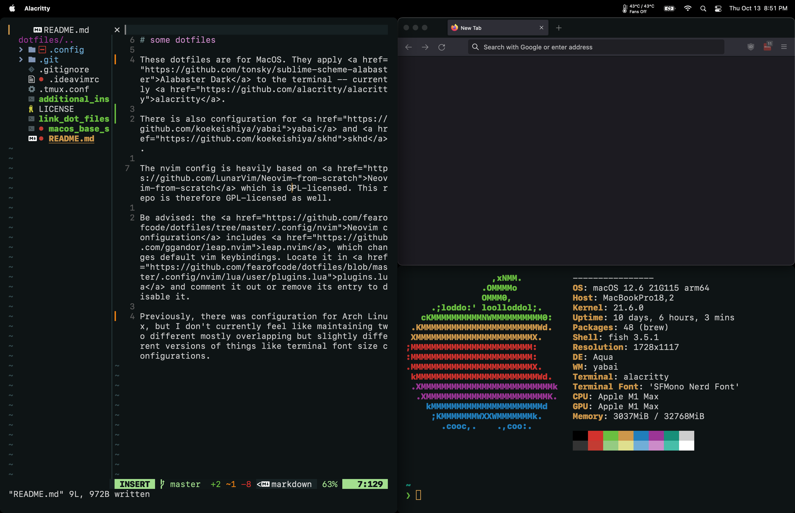

# some dotfiles

These dotfiles are for MacOS. They apply <a href="https://github.com/tonsky/sublime-scheme-alabaster">Alabaster Dark</a> to the terminal -- currently <a href="https://github.com/alacritty/alacritty">alacritty</a>.

There is also configuration for <a href="https://github.com/koekeishiya/yabai">yabai</a> and <a href="https://github.com/koekeishiya/skhd">skhd</a>.

The nvim config is heavily based on <a href="https://github.com/LunarVim/Neovim-from-scratch">Neovim-from-scratch</a> which is GPL-licensed. This repo is therefore GPL-licensed as well.

Be advised: the <a href="https://github.com/fearofcode/dotfiles/tree/master/.config/nvim">Neovim configuration</a> includes <a href="https://github.com/ggandor/leap.nvim">leap.nvim</a>, which changes default vim keybindings. Locate it in <a href="https://github.com/fearofcode/dotfiles/blob/master/.config/nvim/lua/user/plugins.lua">plugins.lua</a> and comment it out or remove its entry to disable it.

Previously, there was configuration for Arch Linux, but I don't currently feel like maintaining two different mostly overlapping but slightly different versions of things like terminal font size configurations.

