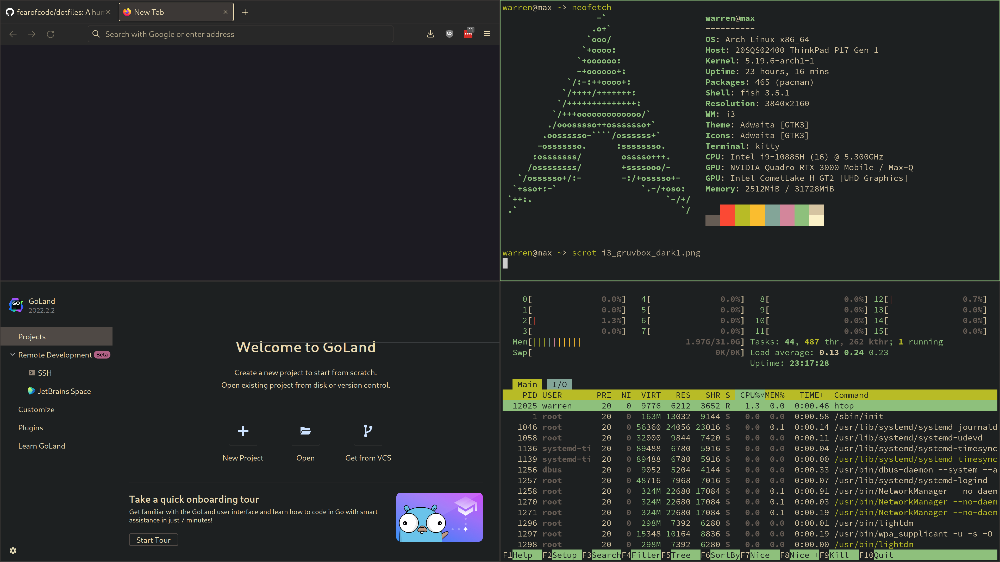

# some dotfiles

This is the beginnings of a gruvbox themed i3 setup for Arch. It's plain i3, not i3-gaps.

The nvim config is heavily based on <a href="https://github.com/LunarVim/Neovim-from-scratch">Neovim-from-scratch</a> which is GPL-licensed. This repo is therefore GPL-licensed as well.

Be advised: the <a href="https://github.com/fearofcode/dotfiles/tree/master/.config/nvim">Neovim configuration</a> includes <a href="https://github.com/ggandor/leap.nvim">leap.nvim</a>, which changes default vim keybindings. However, it would be simple enough to comment out or remove <a href="https://github.com/fearofcode/dotfiles/blob/f1617aaf48d91849f9d9d7464b67bb23adfd1ed4/.config/nvim/lua/user/plugins.lua#L90-L96">the entry for the plugin</a>.

