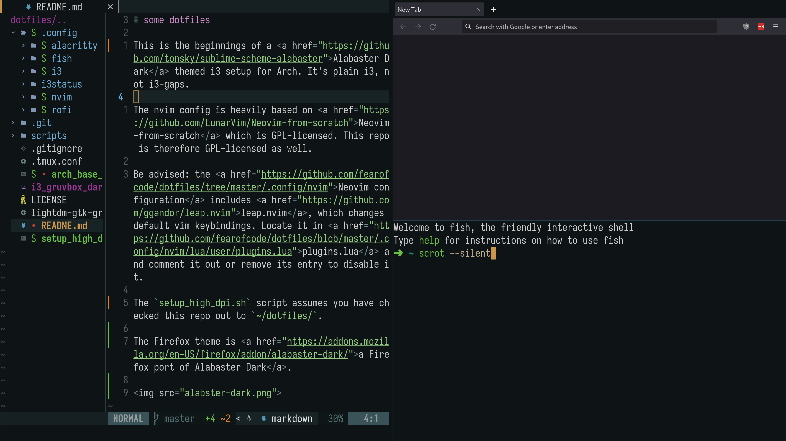

# some dotfiles

This is the beginnings of a <a href="https://github.com/tonsky/sublime-scheme-alabaster">Alabaster Dark</a> themed i3 setup for Arch. It's plain i3, not i3-gaps.

The nvim config is heavily based on <a href="https://github.com/LunarVim/Neovim-from-scratch">Neovim-from-scratch</a> which is GPL-licensed. This repo is therefore GPL-licensed as well.

Be advised: the <a href="https://github.com/fearofcode/dotfiles/tree/master/.config/nvim">Neovim configuration</a> includes <a href="https://github.com/ggandor/leap.nvim">leap.nvim</a>, which changes default vim keybindings. Locate it in <a href="https://github.com/fearofcode/dotfiles/blob/master/.config/nvim/lua/user/plugins.lua">plugins.lua</a> and comment it out or remove its entry to disable it.

The `setup_high_dpi.sh` script assumes you have checked this repo out to `~/dotfiles/`.

The Firefox theme is <a href="https://addons.mozilla.org/en-US/firefox/addon/alabaster-dark/">a Firefox port of Alabaster Dark</a>.

Because i3's window titles are hidden and the i3 status bar is hidden except when you press Super, there is no Alabaster Dark theming of i3. This is simply because I couldn't find one.

